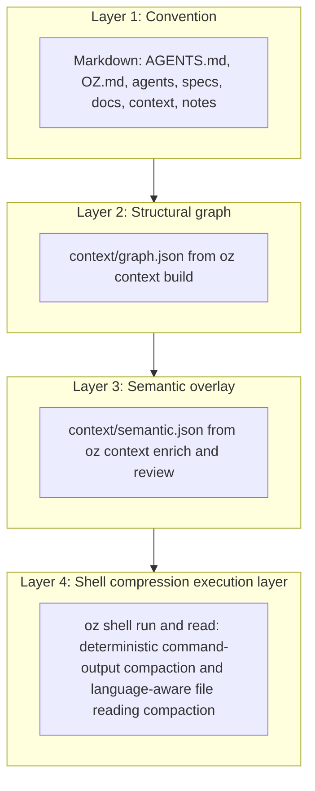
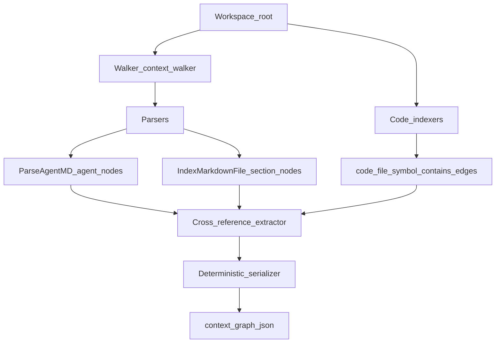
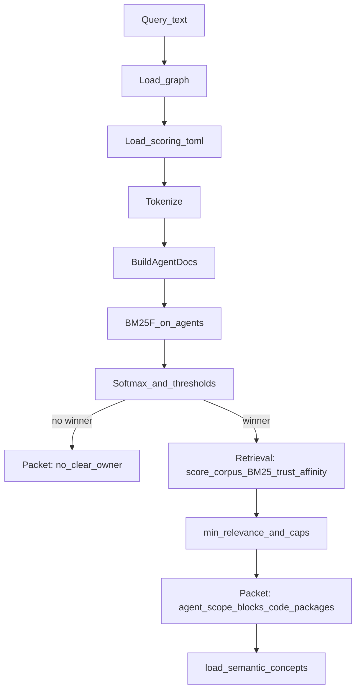
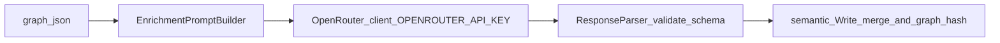
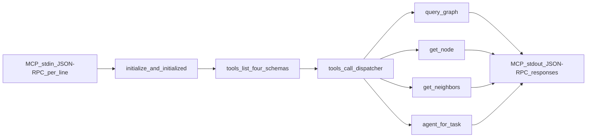
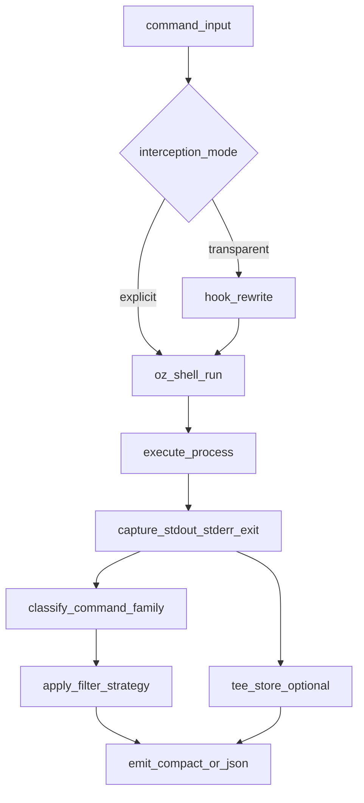
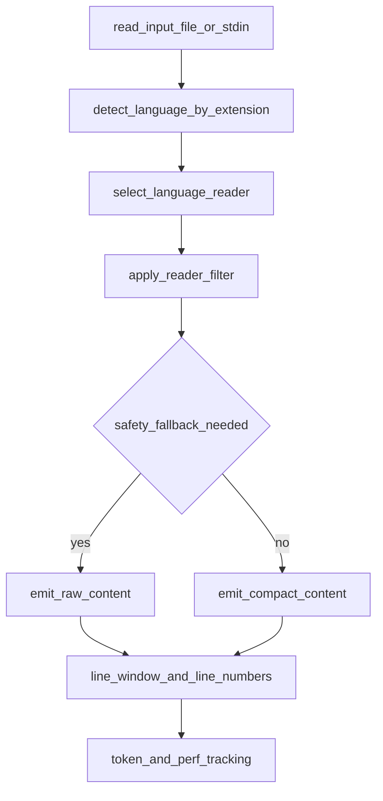

# Architecture

> High-level architecture of oz.

## Overview

**oz** is an open workspace convention and toolset for LLM-first development. It ships as a
single Go binary (`oz`) that scaffolds, validates, and indexes oz-compliant workspaces so any
LLM can understand them without custom integrations.

The oz repository is itself an oz workspace — every structural claim below can be verified by
running `oz context build && oz context query` in this repo.

---

## Four-layer architecture



Layer 1 is always the source of truth. Layers 2 and 3 are derived artefacts; they can be
rebuilt at any time from the workspace convention files. Layer 4 is an execution-time layer
that compacts shell output for LLM consumers without changing command semantics.

---

## Components

### oz binary (`code/oz/`)

Single Go binary built with `go build`. No runtime dependencies. Subcommands:

| Command | Package | Purpose |
|---------|---------|---------|
| `oz init` | `cmd/init.go` + `internal/scaffold/` | Scaffold a new oz-compliant workspace |
| `oz validate` | `cmd/validate.go` + `internal/validate/` | Lint workspace against the convention |
| `oz audit` | `cmd/audit.go` + `internal/audit/*` | Structural + drift checks over `graph.json` and workspace; JSON and human reports |
| `oz context build` | `internal/context/` | Build the structural graph |
| `oz context query` | `internal/query/` | **Route** a task to the best-matching agent, then **retrieve** ranked context (see below) |
| `oz context enrich` | `internal/enrich/` | LLM enrichment pass via OpenRouter |
| `oz context concept add` | `internal/enrich/` + `internal/query/` | Propose one new concept (retrieval-grounded, no agent routing) |
| `oz context review` | `internal/review/` | Human review of semantic overlay |
| `oz context serve` | `internal/mcp/` | MCP stdio server for LLM tool calls |
| `oz shell run` | `internal/shell/` (planned) | Execute shell commands with deterministic compact output and exit-code preservation |
| `oz shell read` | `internal/shell/readfilter` (planned) | Read files/stdin with language-aware compaction and safe fallback to raw content |
| `oz shell gain` | `internal/shell/track` (planned) | Report local token/perf savings from shell command history |

### internal packages

| Package | Responsibility |
|---------|---------------|
| `internal/convention` | Go-typed source of truth for the oz workspace standard |
| `internal/workspace` | Workspace discovery (walks up from `cwd` to find AGENTS.md + OZ.md) |
| `internal/scaffold` | Scaffolding templates (embedded via `//go:embed all:templates`) |
| `internal/validate` | Validation rules: required files, required AGENT.md sections, semantic warnings |
| `internal/graph` | `Graph`, `Node`, and `Edge` types; schema version constant |
| `internal/context` | Walker → parsers → indexer → extractor → serializer |
| `internal/query` | Tokenize → **routing** (BM25F on agent docs, softmax) → **retrieval** (ranked `context_blocks`, `code_entry_points`, packages; separate corpus) |
| `internal/enrich` | Prompt builder → OpenRouter client → response parser → overlay writer |
| `internal/review` | Diff view + interactive accept/reject → semantic.json writer |
| `internal/mcp` | MCP stdio server: JSON-RPC 2.0 framing, four tool implementations |
| `internal/semantic` | `Overlay` schema, load/write helpers, staleness check |
| `internal/openrouter` | Isolated HTTP client for OpenRouter API |
| `internal/testws` | Test workspace builder + YAML fixture loader + golden suite runner |
| `internal/audit` | Finding model, `RunAll`, deterministic sort; subpackages: `orphans`, `coverage`, `staleness`, `drift`, `report` |

---

## oz audit (V1)

`oz audit` (parent command) runs one or more checks, aggregates a single `Report`, and exits
non-zero when `--exit-on` policy is violated (default: any `error`-severity finding).

**Subcommands**: `orphans`, `coverage`, `staleness`, `drift`, and `graph-summary` (legacy
node/edge counts to stdout). With no subcommand, all registered checks run in registration order.

**Shared flags** (parent and subcommands): `--json` (schema_version `"1"`), `--severity`,
`--exit-on`, `--only` (parent only). Drift-specific flags on the parent as well:
`--include-tests` (merge exported symbols from `*_test.go` into drift’s symbol set),
`--include-docs` (scan `docs/` in addition to `specs/` for backticks / `code/` links).

**Determinism**: findings are sorted by `(severity rank, check name, code, file, line,
message)` before render. `encoding/json` map keys (`counts`) are emitted in sorted key order.
Two consecutive runs on an unchanged workspace should yield byte-identical `--json` output
(regression-tested in `internal/audit/audit_e2e_test.go`).

**Finding catalogue** (stable codes): Tier A — `ORPH001`–`ORPH003`, `COV001`–`COV004`,
`STALE001`–`STALE004`. Tier B drift — `DRIFT001`–`DRIFT003` (symbols sourced from graph
`code_symbol` nodes; see `specs/decisions/0001-audit-v1-symbols-from-graph-codeindex.md`).
`DRIFT004` / `DRIFT900` from the PRD are not implemented in V1.

**Performance**: `go test ./internal/audit -bench=BenchmarkAuditAll` exercises the full
check bundle on a small scaffolded workspace (target: sub-second on the oz repo after a
fresh `oz context build`).

---

## Data flow

### oz context build



### oz context query

`oz context query` runs two pipelines that share the same query string and `context/scoring.toml` config, but use **disjoint corpora**: **routing** picks the winning agent; **retrieval** ranks what to read (`context_blocks`, code entry points, and implementing packages). The split is normative in [`specs/routing-packet.md`](../specs/routing-packet.md) and the rationale is [`specs/decisions/0004-context-retrieval-ranking.md`](../specs/decisions/0004-context-retrieval-ranking.md).



`oz context query --raw` returns a **debug JSON envelope** (not the routing packet): routing scores, a query-relevant **subgraph** of `graph.json`, and a **`retrieval` array** with per-candidate `bm25`, `trust_boost`, `agent_affinity`, and `relevance` (see the same ADR).

### oz context enrich



### oz context concept add

`oz context concept add --name "<name>"` proposes **one** new concept into
`context/semantic.json` using retrieval-grounded LLM output. Unlike `enrich`
(which re-extracts all concepts from the full graph), this command targets a
single, named concept and grounds the model in the workspace's existing context.

**When to use each command:**

| Command | Use when |
|---------|----------|
| `oz context enrich` | First-time enrichment or broad re-extraction of the semantic layer |
| `oz context concept add` | Adding one specific concept you have in mind without re-running the full extraction |

```mermaid
flowchart LR
  q[name_and_seed] --> ret[RetrievalForProposal_no_agent_routing]
  ret --> blocks[top_k_ContextBlocks]
  blocks --> prompt[BuildProposalPrompt_allowlist_and_context]
  prompt --> or[OpenRouter_OPENROUTER_API_KEY]
  or --> parse[ParseSingleConcept_strict_1_concept]
  parse --> write[semantic_Merge_Write_reviewed_false]
  write --> review[oz_context_review]
```



The proposed concept is written with `reviewed: false`. Run `oz context review`
to accept or reject it before it affects query routing and retrieval.

**Flags:** `--name` (required), `--seed`, `--from` (repeatable file anchors),
`--retrieval-k` (default 5), `--no-retrieval`, `--print` (dry run — shows prompt
and token count without calling OpenRouter or writing to disk).

### oz context serve (MCP)



### oz shell run (planned)

`oz shell run` is a shell-output compression layer designed to reduce token usage for command
execution workflows while preserving correctness. It supports:

- explicit wrapper mode (`oz shell run -- <cmd...>`)
- optional transparent interception via hooks (opt-in)
- deterministic filter strategies and safe fallback to raw output
- strict exit-code preservation and local token/perf tracking

Normative contract:

- [`specs/oz-shell-compression-specification.md`](../specs/oz-shell-compression-specification.md)
- [`specs/decisions/0005-oz-shell-compression-architecture.md`](../specs/decisions/0005-oz-shell-compression-architecture.md)



### oz shell read (planned)

`oz shell read` is a language-aware reader path for file and stdin content, designed to
reduce token usage for read-heavy workflows while preserving actionable content.

Planned behavior:

- explicit reader mode (`oz shell read -- <file...>` and `oz shell read -` for stdin)
- language-aware reader registry (extension-based dispatch, deterministic transforms)
- strict safety fallback: if filtering empties non-empty content, return raw content with warning
- optional line windowing (`--max-lines`, `--tail-lines`) and line numbering

Planned architecture:



---

## Structural context graph (`context/graph.json`)

`oz context build` walks the workspace (respecting `.ozignore`), parses convention files, indexes source files under `code/`, extracts cross-references, and writes a deterministic JSON graph. The on-disk artefact is `context/graph.json`. The Go types and constants live in `code/oz/internal/graph`; the schema version is `graph.SchemaVersion` (currently `"2"`).

Each graph object includes `schema_version`, `content_hash` (SHA-256 hex of the canonical `nodes` + `edges` JSON, excluding `content_hash`), `nodes`, and `edges`. Nodes and edges are sorted before write so repeated builds with unchanged inputs are byte-identical.

### Node types

| `type` | Meaning |
|--------|---------|
| `agent` | `agents/<name>/AGENT.md` |
| `spec_section` | An H2 section in a file under `specs/` (excluding `specs/decisions/`) |
| `decision` | A file under `specs/decisions/` |
| `doc` | An H2 section in a file under `docs/` |
| `context_snapshot` | A markdown file under `context/` |
| `note` | A markdown file under `notes/` |
| `code_file` | A source file under `code/` with language/package metadata |
| `code_symbol` | An exported source symbol with language, kind, package, and line metadata |

Agent nodes carry optional fields parsed from AGENT.md (`role`, `scope`, `read_chain`, `rules`, `skills`, and related prose). Other nodes include `tier` (`specs`, `docs`, `context`, or `notes`) where applicable.

### Edge types

| `type` | Meaning |
|--------|---------|
| `reads` | Agent read-chain entry resolves to another graph node |
| `owns` | Agent scope path (may target a `path:…` pseudo-id if unmatched) |
| `references` | A document cites another file path (backticks or markdown links) |
| `supports` | A doc-tier node references a spec or decision |
| `crystallized_from` | Reserved for future crystallize integration |
| `contains` | A `code_file` node declares a `code_symbol` node |

`oz audit` loads this file for all checks: orphans/coverage/staleness/drift traverse nodes
and edges; drift additionally treats `code_symbol` nodes as the exported Go symbol catalogue
(see ADR 0001).

---

## Semantic overlay (`context/semantic.json`)

Schema version `"1"`. Produced by `oz context enrich`, reviewed via `oz context review`.

| Field | Description |
|-------|-------------|
| `schema_version` | Always `"1"` |
| `graph_hash` | SHA-256 of `graph.json` at generation time. Used for staleness detection. |
| `model` | OpenRouter model ID used for enrichment (default: `openrouter/free`; override with `--model`) |
| `generated_at` | RFC3339 UTC timestamp of last enrichment run |
| `concepts` | Extracted concept nodes (see below) |
| `edges` | Typed relationships between concepts and structural nodes |

**Concept node fields**: `id` (`concept:<slug>`), `name`, `description`, `source_files`, `tag` (`EXTRACTED` | `INFERRED`), `confidence`, `reviewed`.

**Edge types**: `agent_owns_concept`, `implements_spec`, `drifted_from`, `semantically_similar_to`.

### Staleness detection

On `oz context query` and `oz context serve` startup, the `graph_hash` embedded in `semantic.json` is compared against the SHA-256 of the current `graph.json`. If they differ:

```text
warning: semantic overlay may be stale — run 'oz context enrich' to update
```

---

## Query pipeline: routing and retrieval

The query engine first **routes** (multi-field BM25F over each agent’s AGENT.md-derived “document”), then **retrieves** (BM25 over graph-backed fields for `spec_section`, `decision`, `doc`, `context_snapshot`, `note`, `code_package` / `code_symbol` nodes, with trust and agent-affinity multipliers, then threshold + caps). Tuning for both lives in `context/scoring.toml`: top-level and `[bm25]` / `[fields]` / `[weights]` / `[routing]` for **routing**; `[retrieval]` and nested `retrieval.*` for **retrieval** (and `retrieval.include_notes` for the notes corpus gate). The `oz context scoring` command group lists valid keys, prints effective values, and validates the file; see `docs/implementation.md` for subcommands.

**ADR-0004** (Context retrieval ranking) records why retrieval is separate from routing. **Normative field names and semantics** for the JSON packet are in [`specs/routing-packet.md`](../specs/routing-packet.md).

### BM25F fields (routing, per agent)

| Field | Weight (default) | Source |
|-------|-----------------|--------|
| `scope` | 3.0 | Scope paths from AGENT.md Responsibilities section |
| `role` | 2.0 | Role paragraph from AGENT.md |
| `responsibilities` | 1.5 | Responsibilities section text |
| `read_chain` | 1.0 | Read-chain item paths and descriptions |
| `out_of_scope` | −0.5 | Out-of-scope section (negative weight) |

### IDF floor

IDF is floored at 1.0 to prevent degenerate scores on small corpora (3–5 agents). This resolves pre-mortem risk T-02 (Leiden degeneration) — BM25F with an IDF floor is deterministic and scale-invariant regardless of corpus size.

### Routing decision

1. Compute raw BM25F scores for all agents.
2. Apply temperature-scaled softmax to obtain confidences.
3. If the best raw score is below `routing.min_score` (or equivalent defaults): return `no_clear_owner`.
4. If top confidence is below `routing.confidence_threshold`: include `candidate_agents`.
5. Otherwise: the top softmax winner is the routed agent. (Exact defaults ship with the binary; override via `context/scoring.toml` or `oz context scoring`.)

### Retrieval (after a winner)

1. Build a **retrieval candidate set** from the graph (excludes notes when `retrieval.include_notes` is false; see packet `excluded`).
2. Score each candidate with BM25 (retrieval field weights) × trust boost × agent affinity, sort, drop below `retrieval.min_relevance`, cap (`max_blocks`, `max_code_entry_points`, `max_implementing_packages`, and concept threshold for packages).
3. If **no** context block clears `min_relevance` but an agent is still returned, the packet may set `reason` to `no_relevant_context` and omit `context_blocks` (see `specs/routing-packet.md`).

---

## MCP interface

`oz context serve` implements MCP stdio protocol version `2024-11-05`. JSON-RPC 2.0 framing, one JSON object per line.

### Wire it in

```json
{"mcpServers":{"oz":{"command":"oz","args":["context","serve"]}}}
```

### Tools

| Tool | Input | Output |
|------|-------|--------|
| `query_graph` | `task` (string) | Full routing packet (agent, confidence, scope, context blocks, concepts) |
| `get_node` | `node_id` (string) | Node object with all fields and edges |
| `get_neighbors` | `node_id`, optional `edge_type` | Adjacent node list |
| `agent_for_task` | `task` (string) | `{ agent, confidence }` only — low token cost |

---

## Key decisions

See `specs/decisions/` for architectural decision records (ADRs).
