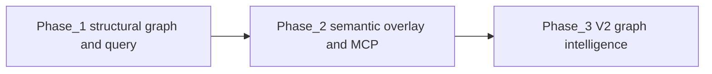

# Product Requirements Document: oz context (V1)

**Author**: oz-spec
**Date**: 2026-04-18
**Status**: Draft
**Stakeholders**: oz-coding, oz-spec, oz-maintainer

---

## 1. Executive Summary

`oz context` is a three-layer knowledge graph engine embedded in the oz binary. It gives any LLM working in an oz workspace a structured, token-efficient, trust-weighted view of the workspace — replacing ad-hoc file reading with a deterministic structural graph, a curated semantic overlay tracked in git, and a JSON routing interface that tells the LLM exactly which agent owns a task and which context blocks to load.

V1 ships all three layers. The structural graph and query interface are pure Go with no LLM dependency. The semantic overlay is an optional, separately-triggered enrichment step.

---

## 2. Background & Context

LLMs entering an oz workspace today have no structured routing mechanism. They read files manually, spend tokens on low-trust content (notes/), miss relationships between agent definitions and the specs they own, and cannot determine agent ownership without reading every AGENT.md. As workspaces grow, this becomes a significant token and latency problem.

The oz source-of-truth hierarchy (specs > docs > context > notes) encodes trust but nothing currently enforces or surfaces it at query time. An LLM asking "who owns the audit command?" has no better option than a full workspace read.

`oz context` solves this by building a graph over the workspace structure, enriching it with reviewed semantic knowledge, and serving compact routing packets on demand. It also provides the structural graph that `oz audit` (planned, priority 3) needs for drift detection — making `oz context` a shared infrastructure layer, not just an LLM tool.

The design is informed by graphify, a Python knowledge graph engine with a proven three-pass architecture. oz context adopts its core pattern — deterministic extraction first, LLM enrichment second, query layer third — and adapts it to oz-specific concerns: agent ownership, source-of-truth hierarchy, workspace convention.

---

## 3. Objectives & Success Metrics

### Goals

1. Any LLM can determine agent ownership of a task in a single `oz context query` call, without reading any workspace files directly.
2. Context packets returned by `oz context query` contain only what is relevant — eliminating notes/ noise and low-trust content unless explicitly requested.
3. The semantic overlay is a git-tracked, human-reviewable artifact that accumulates workspace knowledge over time.
4. `oz audit` can consume the structural graph without any additional extraction step.
5. `oz context serve` exposes the full query interface as an MCP server over stdio, requiring no additional setup beyond the oz binary.

### Non-Goals

1. **Embeddings or vector search** — graph topology and LLM-extracted semantic edges are the similarity signal. No vector database, no embedding step.
2. **Audio/video transcription** — not present in oz workspaces.
3. **Cross-repo or multi-workspace graphs** — V1 scopes to a single workspace root.
4. **Automatic semantic re-enrichment** — the semantic overlay is generated on demand and committed by a human, not auto-regenerated on every build.
5. **Watch mode / git hooks** — deferred to V2. V1 is on-demand only.
6. **Natural language graph reports or wiki generation** — deferred to V2.

### Success Metrics

| Metric | Target | Measurement |
|--------|--------|-------------|
| Token cost per routed task | ≤ 10% of equivalent full workspace read | Compare token counts: `oz context query` output vs reading all relevant files manually |
| Agent ownership accuracy | Correct agent returned for ≥ 95% of unambiguous task queries | Manual evaluation set of 20 representative queries against the oz workspace itself |
| Structural graph build time | < 500ms on a workspace with 50+ files | Benchmarked on oz's own workspace |
| Semantic overlay round-trip | Generate → review → commit workflow completable in < 5 min | Measured on oz workspace first run |
| `oz audit` integration | `oz audit` consumes structural graph without a separate build step | Integration test |

---

## 4. Target Users & Segments

**Primary: LLMs / agents working in oz workspaces**
These are the runtime consumers of `oz context query` and `oz context serve`. They call it at task-start to get routing and scoping information, then load only the returned context blocks. They never read the raw graph files.

**Secondary: oz workspace developers (humans)**
Developers who run `oz context build` and `oz context enrich`, review the semantic overlay before committing it, and diagnose routing issues by inspecting the graph directly.

**Internal: oz audit**
`oz audit` (priority 3 subcommand) consumes the structural graph produced by `oz context build` for drift detection. oz context is shared infrastructure, not just an external-facing tool.

---

## 5. User Stories & Requirements

### P0 — Must Have

| # | User Story | Acceptance Criteria |
|---|-----------|-------------------|
| C-01 | As an LLM, I can run `oz context build` to produce a deterministic structural graph of the workspace with no LLM involvement | `graph.json` is produced in `context/`. Running twice with no file changes produces byte-identical output. No external API calls are made. |
| C-02 | As an LLM, I can run `oz context query "<task description>"` and receive a JSON routing packet telling me which agent owns the task and which context blocks to load | Packet includes: `agent`, `confidence`, `scope` (file paths), `context_blocks` (file + section + trust tier), `excluded` (paths filtered out) |
| C-03 | As an LLM, I can trust that `context_blocks` in the routing packet are ordered by source-of-truth tier (specs > docs > context > notes) | Output is verifiably sorted by trust tier. Notes are excluded by default unless `--include-notes` flag is passed. |
| C-04 | As a developer, I can run `oz context serve` to expose the query interface as an MCP server over stdio | MCP server responds to `query_graph`, `get_node`, `get_neighbors`, `agent_for_task` tool calls. Usable with a standard `.mcp.json` entry pointing to the oz binary. |
| C-05 | As `oz audit`, I can read `context/graph.json` directly to access the structural graph without a separate extraction step | `graph.json` schema is documented and stable. `oz audit` integration test passes consuming this file. |

### P1 — Should Have

| # | User Story | Acceptance Criteria |
|---|-----------|-------------------|
| C-06 | As a developer, I can run `oz context enrich` to trigger an LLM pass that extracts concepts and relationships and writes them to `context/semantic.json` | `semantic.json` is written. It contains extracted concepts, relationship edges tagged `EXTRACTED` or `INFERRED`, confidence scores on INFERRED edges, and source attribution (file + line). |
| C-07 | As a developer, I can review `context/semantic.json` in a standard git diff, edit it to remove incorrect inferences, and commit it as accepted workspace knowledge | File is human-readable JSON. Each node and edge has a `reviewed: bool` field. Committing the file is the acceptance mechanism. |
| C-08 | As an LLM, routing packets from `oz context query` are enriched with semantic concepts when `context/semantic.json` exists | If semantic overlay is present, `relevant_concepts` field is populated in the routing packet. If absent, field is omitted — no error. |
| C-09 | As a developer, I can run `oz context query` with a `--raw` flag to receive debug JSON instead of the routing packet, for debugging | Payload includes `query`, the routing `result`, per-agent raw BM25F scores and softmax confidences, and a bounded `subgraph`: all agent nodes, nodes matching `context_blocks` from the result, and edges with both endpoints in that set (not the entire workspace graph). |

### P2 — Nice to Have / Future

| # | User Story | Acceptance Criteria |
|---|-----------|-------------------|
| C-10 | As a developer, I can run `oz context diff <commit>` to see what changed in the structural graph since a given commit | Output shows added/removed nodes and edges in a readable diff format |
| C-11 | As a developer, running `oz context build` detects and reports agent scope conflicts (two agents claiming ownership of the same path or concept) | Build output includes a `warnings` section listing conflicts. Exit code remains 0 — warnings do not block. |
| C-12 | As a developer, `oz context enrich` accepts a `--model` flag to select which LLM performs the enrichment pass | Supported values: any model accessible via the configured API key. Default is the cheapest capable model. |

---

## 6. Solution Overview

### Architecture: Three Layers

```mermaid
flowchart TB
  subgraph layerStruct ["Layer 1: Structural graph"]
    graph["context/graph.json deterministic build"]
  end
  subgraph layerSem ["Layer 2: Semantic overlay"]
    sem["context/semantic.json enrich and review"]
  end
  subgraph layerQuery ["Layer 3: Query and routing"]
    query["oz context query and MCP tools"]
  end
  layerStruct --> layerSem
  layerStruct --> layerQuery
  layerSem --> layerQuery
```

#### Layer 1 — Structural graph (deterministic, no LLM)

A pure Go parser walks the workspace and extracts:

- All agent definitions: name, scope paths, read-chain, declared ownership
- All spec sections and the decisions that back them
- All docs, context snapshots, and notes — tagged by source-of-truth tier
- Cross-references: which agent reads which spec, which decision supports which spec section, which notes relate to which docs

Output: `context/graph.json` — nodes typed as `agent`, `spec_section`, `doc`, `context_snapshot`, `note`, `decision`. Edges typed as `reads`, `owns`, `supports`, `references`, `crystallized_from`. No `INFERRED` edges — Layer 1 is structural only.

Determinism guarantee: identical workspace = identical output (sorted keys, stable serialisation, no timestamps in content hash).

#### Layer 2 — Semantic overlay (LLM-produced, git-tracked)

A separate `oz context enrich` command (not run automatically). An LLM pass over the structural graph extracts:

- Concept nodes (abstract ideas present across multiple files)
- `implements_spec`, `drifted_from`, `semantically_similar_to`, `agent_owns_concept` edges
- Each edge tagged `EXTRACTED` (found directly) or `INFERRED` (reasonable inference) with a `confidence_score` (0.0–1.0 for INFERRED, always 1.0 for EXTRACTED)

Output: `context/semantic.json` — a delta overlay, not a replacement for `graph.json`. Human-reviewed and committed to git. Unenriched workspaces work fine — semantic.json is optional.

LLM calls are made via **OpenRouter** (`OPENROUTER_API_KEY`). Model is selectable with `--model`. This is the only external network dependency in the entire oz binary, and it is isolated to `oz context enrich`.

#### Layer 3 — Query and routing (pure logic, no LLM at runtime)

`oz context query "<task>"` merges structural graph + semantic overlay at call time:

1. Tokenises the query against agent scope declarations and concept nodes
2. Scores candidate agents by scope match + concept proximity
3. Filters context blocks: excludes notes/ by default, sorts by trust tier
4. Returns a JSON routing packet

```json
{
  "agent": "oz-coding",
  "confidence": 0.95,
  "scope": ["code/oz/cmd/audit.go", "specs/oz-project-specification.md"],
  "context_blocks": [
    { "file": "specs/oz-project-specification.md", "section": "audit", "trust": "high" },
    { "file": "agents/oz-coding/AGENT.md", "section": "scope", "trust": "high" }
  ],
  "relevant_concepts": ["drift-detection", "tree-sitter"],
  "excluded": ["notes/"]
}
```

`oz context serve` wraps this in an MCP stdio server, exposing `query_graph`, `get_node`, `get_neighbors`, and `agent_for_task` as tool calls.

### Scoring Algorithm (resolves T-01)

`oz context query` ranks candidate agents using **BM25F over weighted agent fields**, then converts raw scores to confidence via temperature-scaled softmax. Deterministic, dependency-free, small-corpus safe.

**Step 1 — Build per-agent multi-field documents.** Each agent is indexed with five fields, each with its own weight:

| Field | Source | Weight | Rationale |
|---|---|---|---|
| `scope` | Explicit scope paths + "Responsibilities" section of AGENT.md | 3.0 | Strongest ownership signal — declared by the agent itself |
| `role` | "Role" section of AGENT.md | 2.0 | High-level "who am I" statement |
| `out_of_scope` | "Out of scope" section of AGENT.md | -2.0 | **Negative** weight — explicit disownment |
| `readchain` | Text of files in the agent's read-chain | 0.3 | Weak signal — reading ≠ owning |
| `concept` | Labels of concept nodes with `agent_owns_concept` edge (semantic overlay only) | 2.5 | Second-strongest when overlay exists; 0 when absent |

**Step 2 — Tokenize deterministically.** Lowercase → strip punctuation → split on whitespace → filter stopwords (hardcoded English list) → Porter stemmer → emit unigrams; adjacent stem **bigrams** (`stem_i_stem_j`) when `use_bigrams = true` in `context/scoring.toml` (default `false` so compound phrases do not over-index). Porter stemming is deterministic and implemented in-tree as Go source; no external stemmer dependency.

**Step 3 — Score with BM25F.** For each candidate agent:

```text
score(agent, query) = Σ over query terms t:
    IDF(t) · tf̃(t, agent) · (k1 + 1) / (tf̃(t, agent) + k1)

where:
  tf̃(t, agent) = Σ over fields f:
      weight(f) · tf(t, f) / (1 - b + b · |f| / avg_len(f))
  IDF(t)       = ln((N - n(t) + 0.5) / (n(t) + 0.5) + 1)
  N            = number of agents in the workspace
  n(t)         = number of agents whose document contains t
```

Defaults: `k1 = 1.5`, `b = 0.75`. The negative `out_of_scope` weight subtracts when terms appear in that field — an agent that explicitly disclaims the query's domain is penalised.

**Step 4 — Softmax confidence.** Raw BM25 scores are not comparable across queries. Normalize:

```text
confidence(agent_i) = exp(score_i / T) / Σ_j exp(score_j / T)
```

Temperature `T` controls sharpness. Low `T` gives sharp winners; high `T` keeps close scores ambiguous. Default `T = 1.0`.

**Step 5 — Absolute floor and routing decision.**

```text
if max(raw_scores) < MIN_SCORE:
    return { agent: null, confidence: 0, reason: "no_clear_owner" }
if confidence(top) >= CONFIDENCE_THRESHOLD:
    return { agent: top, confidence, ... }          // unambiguous
else:
    return { agent: top, confidence,
             candidate_agents: [all with confidence ≥ 0.2 sorted desc] }
```

**Tuning surface.** All parameters live in `context/scoring.toml`, editable per workspace without recompiling:

| Parameter | Default | Tunes |
|---|---|---|
| `w_scope`, `w_role`, `w_out_of_scope`, `w_readchain`, `w_concept` | 3.0, 2.0, -2.0, 0.3, 2.5 | Field emphasis |
| `k1` | 1.5 | BM25 term saturation |
| `b` | 0.75 | Length normalization |
| `T` | 1.0 | Confidence sharpness |
| `MIN_SCORE` | 0.5 | No-owner threshold |
| `CONFIDENCE_THRESHOLD` | 0.7 | Ambiguity surface |

Defaults are set by running the golden suite (see `docs/test-framework.md`) and picking the configuration that maximises accuracy across fixtures.

**Why this and not alternatives:**

- **Not embeddings** — adds a dependency and a second similarity signal that may contradict the reviewed semantic overlay. Non-goal already locked in §3.
- **Not Leiden community detection** — per T-02, degenerates on graphs of ~20–40 nodes which is the oz workspace scale. BM25F works from N=2 upward.
- **Not pure keyword intersection** — doesn't handle term saturation, document length, or idf. Gives high confidence to agents with verbose AGENT.md files unfairly.
- **BM25F** — mature, ~50 lines of Go, behaves sensibly on both small and large corpora, has a clean tuning surface, and treats agent declarations as authoritative text.

### Key Design Decisions

- **graph.json and semantic.json are separate files.** The structural graph is always fresh and cheap to rebuild. The semantic overlay is expensive and curated. Merging them at query time means either can be updated independently.
- **Routing is BM25F over weighted agent fields, not embeddings or Leiden.** Agent scope declarations are explicit strings; BM25F is the right tool for weighted term matching over small multi-field corpora. No vector database, no community detection, no external dependency.
- **Notes excluded by default.** The source-of-truth hierarchy is enforced at the query layer, not just documented. An LLM must opt in to receiving low-trust content.
- **MCP server is the oz binary itself.** No separate process, no Python runtime. `.mcp.json` points to `oz context serve`.

---

## 7. Decisions

The following questions were raised during PRD review and resolved:

| Question | Decision |
|----------|----------|
| Where do `graph.json` and `semantic.json` live? | `context/` — visible, git-trackable, consistent with the workspace convention. |
| Should `context_blocks` use line ranges or section anchors? | Section anchors (markdown headers) — stable across edits, sufficient precision for oz workspaces. |
| How does query handle a task spanning two agents' scopes? | Return top agent with `confidence < 0.7` as ambiguity signal, plus a `candidate_agents` array with scores. |
| Should `oz context build` run automatically inside `oz validate`? | No — on-demand only in V1. `oz validate --with-context` flag available if the caller wants it. |
| What LLM provider for `oz context enrich`? | **OpenRouter** — provider-agnostic routing via a single API key. Configured via `OPENROUTER_API_KEY` env var. `--model` flag selects the model (any OpenRouter-supported model). Default: a capable, cost-efficient model TBD at implementation time. |
| Should V1 include embeddings for semantic similarity? | **No.** oz workspaces are small and structured. Agent scope declarations are explicit; concept relationships are extracted as named, reviewed edges in the semantic overlay. Graph topology is the similarity signal. Embeddings would add a dependency and a second similarity signal that may contradict the curated overlay. Revisit in V2 only if routing accuracy is demonstrably poor for novel task descriptions. |

---

## 8. Timeline & Phasing



### Phase 1 — Structural Graph + Query (pure Go, no LLM dependency)

Delivers C-01, C-02, C-03, C-05, C-09.

- `oz context build` → `context/graph.json`
- `oz context query "<task>"` → JSON routing packet (structural only, no semantic enrichment)
- Shared graph consumed by `oz audit`
- No external API calls

This phase unblocks `oz audit` development and delivers the core token-saving routing benefit immediately.

### Phase 2 — Semantic Overlay + MCP Server

Delivers C-04, C-06, C-07, C-08.

- `oz context enrich` → `context/semantic.json`
- `oz context serve` → MCP stdio server
- Routing packets enriched with concept nodes when semantic.json present

### Phase 3 — Graph Intelligence (V2 scope)

Delivers C-10, C-11, C-12, plus watch mode, git hooks, and conflict detection.

---

*This PRD supersedes the `oz context` section of `specs/oz-project-specification.md` where they conflict. Once V1 ships, the spec should be updated to reflect the implementation.*
