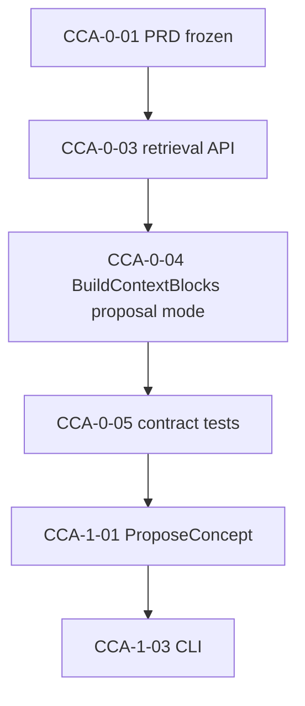

# oz `context concept add` — Sprint Plan

**Author**: oz-spec  
**Date**: 2026-04-25  
**Status**: Draft  
**PRD**: [oz-context-concept-add-prd.md](oz-context-concept-add-prd.md)  
**Pre-mortem**: [oz-context-concept-add-premortem.md](oz-context-concept-add-premortem.md)  
**Format**: 1-week sprints, **1 FTE** assumed (adjust capacity if part-time)

---

## Capacity model (sprint planning)

| Assumption | Value |
|------------|--------|
| Team size | 1 developer (oz-coding) |
| Sprint length | 1 week |
| Velocity (placeholder) | **8 story points** per sprint if using points; else **4–5 concrete stories** per sprint |
| Buffer | Reserve **~20%** for test fixes, review comments, and `oz validate` / graph churn |

**Committed load rule:** do not commit more than **6 points** of risky work in sprint 1 (new API surface + behavior contract).

---

## Sprint CCA-0 — Spec + retrieval API + test harness

**Sprint goal:** The **retrieval-only** path is designed, implemented behind a clear API, and covered by tests that address **pre-mortem T1 and T2** (no surprise divergence; stable behavior without a winning agent).

### Stories

| ID | Story | Est. | Acceptance criteria |
|----|--------|------|---------------------|
| CCA-0-01 | **Freeze PRD + sprint doc** | S | [PRD](oz-context-concept-add-prd.md) and this file merged; pre-mortem launch-blocking actions T1–T3 have matching engineering tasks in stories below. |
| CCA-0-02 | **Spec: `semantic-overlay` + optional ADR** | M | [specs/semantic-overlay.md](../../specs/semantic-overlay.md) documents the add-concept workflow; `implements` edge type listed if missing; optional ADR for CLI + merge contract. |
| CCA-0-03 | **`query`: retrieval-for-proposal API** | L | New function(s) (name TBD) that load graph + config, tokenize query string, return `ContextBlock`-like list, `relevant_concepts`, `implementing_packages`, and optionally code entry points **without** `Route` / winning agent. **No** reuse of `query.Run` result as a whole without refactor. |
| CCA-0-04 | **Refactor / mode flag for `BuildContextBlocks`** | L | [contextbuilder.go](../../code/oz/internal/query/contextbuilder.go) (or equivalent) supports “proposal” mode: survivors do not depend on a routed agent scope; behavior documented in code comment + tests. |
| CCA-0-05 | **Contract / integration tests** | M | Tests assert stable top-k **file+section** (or file-only) for fixed query on golden fixture; compare or pin behavior so T1 “divergence” is caught in CI. |
| CCA-0-06 | **Spike: token budget** | S | One-off measure of max prompt size for this repo: retrieval slice + allowlist strategy; document cap approach for CCA-1 (addresses T3). |

### Definition of done (CCA-0)

- `go test ./internal/query/...` passes.  
- No user-facing `concept add` yet—**OK** for CCA-0.  
- Pre-mortem T1, T2 have test or doc mitigation **in main or feature branch** before CCA-1.

### Dependencies

- None external. Internal: must align with [scoring.toml](../../context/scoring.toml) defaults for retrieval limits.

### Risks (this sprint)

| Risk | Mitigation |
|------|------------|
| API churn breaks later enrich wiring | Name the public func `RetrievalForProposal` or similar; keep internal helpers private until stable. |
| Scope creep into full CLI | CCA-0 **does not** add Cobra `concept` subcommand. |

---

## Sprint CCA-1 — Propose pipeline + CLI + docs + dogfood

**Sprint goal:** Shippers can run **`oz context concept add`**, get a valid unreviewed proposal in `semantic.json`, and complete **`oz context review`**.

### Stories

| ID | Story | Est. | Acceptance criteria |
|----|--------|------|---------------------|
| CCA-1-01 | **`enrich`: `ProposeConcept` (prompt + OpenRouter + parse + merge)** | L | New prompt template; single-concept strict parse; `reviewed: false` on new items; reuses `semantic.Merge` + `Write`. |
| CCA-1-02 | **Node catalog for valid `To` targets** | M | Trimming strategy per PRD: enough IDs for `implements` / `implements_spec` / etc., without blowing token budget; integration test on fixture. |
| CCA-1-03 | **CLI: `oz context concept add`** | M | Cobra under `context`; flags: at least `--name`, `--seed`, `--from`, `--no-retrieval`, `--print`; `OPENROUTER_API_KEY` error matches enrich style. |
| CCA-1-04 | **User docs + help text** | S | [docs/guides/graph-and-mcp.md](../../docs/guides/graph-and-mcp.md) or [docs/architecture.md](../../docs/architecture.md) one section; `Long` help on command distinguishes **enrich** vs **concept add**. |
| CCA-1-05 | **End-to-end + dogfood** | M | On this repo: run propose (throwaway name), see unreviewed items, **reject** in `review`, confirm clean. Document in PR or release notes. |
| CCA-1-06 | **Parser UX hardening** | S | **Fast-follow T4:** clear error when model returns multiple concepts or invalid JSON. |

### Definition of done (CCA-1)

- `go test ./...` (or repo scope) green; `oz validate` green.  
- PRD key results (Section 4) satisfied for V1.  
- Pre-mortem T3 mitigations **verified** (measured prompt size) or **explicitly** deferred with issue link.

### Dependencies

- **Blocks on:** CCA-0 complete (retrieval API + tests).  
- **External:** OpenRouter key in dev environment for CCA-1-05.

### Sprint plan summary (CCA-1)

| Field | Value |
|-------|--------|
| **Sprint goal** | Shippable `oz context concept add` with review workflow and documentation |
| **Duration** | 1 week |
| **Team capacity (placeholder)** | 8 points |
| **Committed** | ~6–7 points of stories (buffer for T4 and fixes) |
| **Buffer** | ~1 point / flex time |

---

## Backlog (post V1 / fast-follow)

| Item | Pre-mortem ref | Notes |
|------|----------------|--------|
| Parser UX and golden tests for edge cases | T4 | CCA-1-06 or next sprint |
| Review automation guardrails (CI) | T6 | Document “do not `--accept-all` on unseen proposals” |
| Near-duplicate concept name warning | T5 | Heuristic compare to existing `concept:` slugs |
| MCP `propose_concept` | PRD V2 | Same core as CLI |
| Rate limiting / idempotency for agents | E3 | Track |

---

## Dependency graph (high level)

**Critical path:** CCA-0 retrieval + survivor behavior → CCA-1 enrich + CLI.

---

## Sprints at a glance

| Sprint | Focus | Exit criteria |
|--------|--------|----------------|
| **CCA-0** | Retrieval-only API + tests + spec updates | Merged code + tests; no end-user command yet |
| **CCA-1** | Propose + CLI + dogfood + docs | `concept add` works end-to-end with `review` |

---

*Sprint plan aligned with [oz-context-concept-add-prd.md](oz-context-concept-add-prd.md). Revisit capacity after CCA-0 if retrieval refactor was larger than estimated.*
