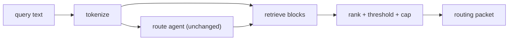
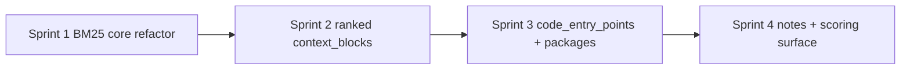

# Product Requirements Document: oz retrieval (V1)

**Author**: oz-spec
**Date**: 2026-04-24
**Status**: Draft
**Stakeholders**: oz-coding, oz-spec, oz-maintainer
**Supersedes**: the "Selection semantics" section of `specs/routing-packet.md` on acceptance
**Related ADR**: `specs/decisions/0004-context-retrieval-ranking.md`

---

## 1. Executive Summary

`oz context query` today routes well (BM25F over agent docs picks the right owner) but retrieves badly. The routing packet returns every spec section, every decision, and docs/context gated only by the winning agent's `reads` edges — unranked, capped only by workspace size. On a representative query ("how is drift detection implemented?") it returns 48 blocks, of which roughly 40 are unrelated spec sections (routing-packet internals, semantic-overlay, project overview, etc.).

`oz retrieval` V1 replaces the selection logic with a ranked, scored, thresholded pipeline that reuses the BM25 math already shipped for routing. It adds `code_entry_points` as a first-class field so "how is X implemented?" queries return symbols (not just specs). It tightens `implementing_packages` from "any concept sharing one token" to "concepts in the top-k for the query." And it moves notes from blanket exclusion to a low-trust tier that surfaces when — and only when — it has the best answer.

Routing itself is unchanged. The agent routing corpus stays agent-only; the retrieval corpus is new and separate.

---

## 2. Background & Context

`oz context query` has two jobs that are currently collapsed into one pipeline:

1. **Routing** — pick the agent that owns the task. This works today.
2. **Retrieval** — pick the context the caller should actually read before acting. This does not.

The shipped `BuildContextBlocks` (`code/oz/internal/query/contextbuilder.go`) selects blocks with these rules:

- All `spec_section` and `decision` nodes are included unconditionally.
- `doc` and `context_snapshot` nodes are included only if the winning agent has a `reads` edge to them.
- `note` nodes are excluded unless `include_notes` is enabled.
- Blocks are sorted by `(trust, file, section)` — no relevance signal.

Real-world feedback on the query "how is drift detection implemented?" surfaced four gaps:

1. **Firehose, not filter.** 48 blocks returned; ~40 unrelated. BM25F routes the agent but is not used to rank blocks. Either score blocks against the query and cut below a threshold, or at minimum return a score field so consumers can rank.
2. **`implementing_packages` over-inclusive.** `audit/drift` is the answer. `audit` as parent is fine. But `graph` and `semantic` come along because those concepts scored above zero against query tokens. No ranking, no cap.
3. **No code-level entry points.** "How is X implemented?" is a code question. `code_symbol` nodes exist in the graph (`drift.Run`, `drift.LoadSymbols`, `specscan.Scan`, `drift.Symbol`, `drift.Candidate`) — none surface because the packet has no field for them.
4. **Notes excluded unconditionally.** `notes/planning/oz-audit-v1-prd.md` and `notes/planning/oz-codeindex-v1-sprints.md` contain the design rationale for drift detection. Blanket exclusion throws that away.

Bottom line: the pipeline is valuable as a routing system. It is not yet valuable as a context-retrieval system. The highest-leverage fix is ranking/filtering `context_blocks` by query relevance; second-highest is surfacing symbols from implementing packages.

---

## 3. Objectives & Success Metrics

### Goals

1. `context_blocks` are ranked by query relevance and capped; a query returns signal, not a firehose.
2. `code_entry_points` is a first-class packet field, populated from `code_symbol` nodes for code-level queries.
3. `implementing_packages` is a curated, ranked list — not every package touched by any matching concept.
4. Notes participate in retrieval as a low-trust tier, downweighted but not excluded, so design rationale can surface when it is the best answer.
5. Routing (agent selection) is unchanged. This is additive to retrieval only.

### Non-Goals

1. **Embeddings or vector search.** Carried forward from `oz context` V1 non-goals. BM25 over the existing graph is the similarity signal.
2. **New node or edge types.** Retrieval reads `spec_section`, `decision`, `doc`, `context_snapshot`, `note`, `code_package`, `code_symbol` — all already in the graph.
3. **Inlined file contents in packets.** Packets stay references. Body tokens are loaded on demand for scoring, never serialised into the packet.
4. **Separate `retrieve` CLI.** One call returns route + context. Orchestration stays on the oz side, not on every consumer.
5. **Fixing the three known adjacent bugs** (agent parser mangling skills on backticks, review state inconsistency in `semantic.json`, rules files not indexed as graph nodes). Tracked separately — see §9.

### Success Metrics

| Metric | Target | Measurement |
|---|---|---|
| Firehose reduction | For "how is drift detection implemented?": ≤12 `context_blocks` returned | Golden query suite |
| Top-K precision | Top-5 blocks include `specs/audit-catalogue.md`, ADR-0001, and `docs/architecture.md` sections on audit | Golden query suite assertion |
| Code entry points surfaced | Same query returns `drift.Run`, `drift.LoadSymbols`, `specscan.Scan` in `code_entry_points` top-5 | Golden query suite assertion |
| Package precision | Same query returns `audit/drift` (and only optionally `audit` parent) in `implementing_packages`; no `graph`, no `semantic` | Golden query suite assertion |
| Notes surface when relevant | Query against known notes-only content returns the relevant note in top-K at `trust: "low"` | Golden query suite assertion |
| Routing unchanged | All existing routing golden suites (01_minimal, 02_medium, 03_large) still pass at current accuracy floors | Existing `TestRoutingAccuracy` harness |
| Query latency | p95 ≤ 2× current baseline on the oz workspace itself | Benchmark in `internal/query/` |

---

## 4. Target Users & Segments

**Primary: LLMs calling `oz context query` or MCP `query_graph`.** Today they either ignore the firehose or waste tokens reading it. Post-V1 they receive a ranked top-K they can load end-to-end.

**Secondary: oz workspace developers running `oz context query` interactively** to diagnose ownership and find entry points without navigating the workspace manually.

**Internal: MCP consumers** pinning on the packet shape. New fields are additive; existing consumers that ignore unknown fields are unaffected.

---

## 5. User Stories & Requirements

### P0 — Must Have

| # | User Story | Acceptance Criteria |
|---|---|---|
| R-01 | As a caller, I receive `context_blocks` ranked by query relevance, not by trust tier alone | Each block carries a `relevance` field ≥ `retrieval.min_relevance`. Sort order is `(relevance DESC, trust, file, section)`. `retrieval.max_blocks` truncates the list (default 12). |
| R-02 | As a caller asking a code-level question, I receive `code_entry_points` pointing to actual symbols | New packet field `code_entry_points`: array of `{file, symbol, kind, line, package, relevance}`. Populated from scored `code_symbol` nodes eligible via agent scope OR reviewed `implements` chain. Capped at `retrieval.max_code_entry_points` (default 5). |
| R-03 | As a caller, I receive `implementing_packages` ranked by query-concept relevance and capped | Concepts are scored against the query with BM25 over `(name, description)` using `[retrieval.concepts]` weights. Only concepts with `score ≥ retrieval.concept_min_relevance` walk `implements` edges. Packages sorted by max reaching concept score, truncated to `retrieval.max_implementing_packages` (default 5). |
| R-04 | As a caller, I can opt notes out or keep them in, with notes downweighted by default | `retrieval.include_notes` (default `true`) makes notes eligible; they flow through the ranked pipeline with `trust_boost_notes = 0.6`. `false` hard-excludes notes and adds `"notes/"` to `excluded`. |
| R-05 | As a caller routing unchanged queries, I get the same agent with the same confidence | The agent-routing corpus is unchanged. `TestRoutingAccuracy` passes all golden suites at their current floors. `confidence`, `agent`, `candidate_agents`, `no_clear_owner` behaviour is byte-identical pre/post except where routing output embeds retrieval output. |
| R-06 | As a developer, the retrieval scorer is tuneable per workspace without recompile | New `[retrieval]` and `[retrieval.bm25]` / `[retrieval.fields]` / `[retrieval.concepts]` sections in `context/scoring.toml`. `oz context scoring` (`list`, `describe`, `get`, `set`, `show`, `validate`) knows the new keys. |

### P1 — Should Have

| # | User Story | Acceptance Criteria |
|---|---|---|
| R-07 | As a developer, I can see per-block retrieval math under `--raw` | Debug envelope includes per-block BM25 score, trust boost, agent affinity boost, and final relevance. Existing `--raw` consumers still see the routing subgraph. |
| R-08 | As a developer, a golden query suite exercises retrieval outputs, not just routing | New suite `04_retrieval` under `internal/query/testdata/golden/`. Each case asserts a top-K membership expectation on `context_blocks`, `code_entry_points`, and/or `implementing_packages`. |
| R-09 | As a caller, when retrieval returns zero blocks above threshold, the packet degrades gracefully | `context_blocks` absent (not empty-with-error). `reason` field set to `"no_relevant_context"` when routing succeeded but retrieval produced nothing. |

### P2 — Nice to Have / Future

| # | User Story | Acceptance Criteria |
|---|---|---|
| R-10 | As a developer, I can see which scoring parameters the golden suite is most sensitive to | `oz context scoring tune` runs the golden suite under a small grid search and reports which knob moves accuracy most. |
| R-11 | As a developer, body-token loading is cacheable across queries | On-demand tokenized bodies cached in process keyed on graph `content_hash`. Second query over same graph re-uses cache. |

---

## 6. Solution Overview

### Pipeline



Routing and retrieval run over disjoint corpora. Routing keeps its agent-only BM25F. Retrieval ingests `spec_section`, `decision`, `doc`, `context_snapshot`, `note`, `code_package`, `code_symbol`.

### Scoring (per block)

```
score(block) =
    BM25(query_terms, block_fields)
  * trust_boost(block.tier)
  * agent_affinity(block, winning_agent)
```

- **BM25** — same `normTF` / IDF form as `ComputeBM25F` (`code/oz/internal/query/scorer.go`), refactored so helpers (`normTF`, `avgFieldLengths`, `computeDF`) accept a generic field-doc shape instead of `AgentDoc`. Fields and weights configured in `[retrieval.fields]`.
- **trust_boost** — multiplicative factor per tier. Defaults: `specs=1.3`, `docs=1.0`, `context=1.0`, `code=0.9`, `notes=0.6`. A factor < 1.0 downweights without excluding.
- **agent_affinity** — `1.2` when the block is connected to the winning agent via `reads`, `owns`, or `agent_owns_concept → implements`; `1.0` otherwise. Replaces the current hard gate on `reads` edges for docs/snapshots.

### Selection

1. Drop blocks with `score < retrieval.min_relevance`.
2. Sort by `(score DESC, trust, file, section)`.
3. Truncate to `retrieval.max_blocks`, preserving at least one survivor per declared agent scope path if any such block cleared the threshold.

### Code entry points

Top-K `code_symbol` blocks where the symbol's `file` is under the winning agent's scope OR its containing `code_package` has a reviewed `implements` edge to a concept above `retrieval.concept_min_relevance`. Capped at `retrieval.max_code_entry_points`.

### `implementing_packages`

Concepts scored against the query via retrieval BM25; surviving concepts walk reviewed `implements` edges to packages; packages ranked by max reaching concept score; capped.

### Notes

Notes enter the same ranked pipeline at trust_boost 0.6. They only surface when they outscore higher-trust material. `include_notes=false` hard-excludes them from the corpus and reports `"notes/"` in `excluded`.

### What does not change

- Agent routing (BM25F over agent docs, softmax, thresholds).
- The `no_clear_owner` path.
- Graph schema (no new node or edge types).
- Semantic overlay review gate (ADR-0003).
- MCP tool contract (`query_graph` returns the same packet shape, with new fields additive).

See ADR-0004 for the full design decision and rejected alternatives.

---

## 7. Decisions

| Question | Decision |
|---|---|
| Where does retrieval scoring config live? | New `[retrieval]` + `[retrieval.*]` tables in `context/scoring.toml`. Keeps one config surface. |
| Are body tokens baked into `graph.json` or loaded on demand? | On-demand with an in-process cache keyed on graph `content_hash`. Avoids growing `graph.json`; adds one I/O per block scored (mitigated by cache). |
| Does `include_notes` default flip? | Yes — `true`. With `trust_boost_notes = 0.6` notes are downweighted, not excluded. The old "hard-exclude notes" behaviour is preserved via `include_notes=false`. |
| Are code symbols surfaced as context blocks or a separate field? | Separate field. Context blocks are file+section references; code symbols are file+line+symbol tuples. Overloading hides the difference from consumers. |
| Do we fix the three adjacent bugs in V1? | No. Parser-mangling-skills, review-state inconsistency, and rules-not-node-ized are out of scope. Called out in §9 and get their own tracking. |

---

## 8. Timeline & Phasing



See `oz-retrieval-v1-sprints.md` for detail. Each sprint has at least one acceptance query from the new `04_retrieval` golden suite.

---

## 9. Related gaps (not in scope, tracked separately)

These were surfaced by the same review and affect retrieval quality indirectly. They are not blockers for V1 but should be tracked:

1. **Agent parser mangles skills list on backticks / em-dashes.** `code/oz/internal/context/parser.go` splits mid-sentence, producing tokens like `"skills/oz/\` — run the"`. Garbled tokens poison BM25F during routing. Small bug; own commit, not part of this PRD.
2. **Review state inconsistent in `semantic.json`.** Every edge has `reviewed: true`; every concept has `reviewed: false`. Either the enrich pipeline auto-accepts edges but not concepts (unintended), or `oz context review` covers edges only (gap). Worth checking — if unintentional, audit staleness or validate will flag it oddly.
3. **`rules/coding-guidelines.md` referenced by every agent but not a graph node.** If rules are authoritative, they deserve node-hood — especially for coverage checks and for retrieval to surface them. Probably merits ADR-0005 and a small follow-up PRD.

---

*This PRD is the planning source of truth for the retrieval work. On acceptance, `specs/routing-packet.md` and `specs/decisions/0004-context-retrieval-ranking.md` become the normative contract.*
