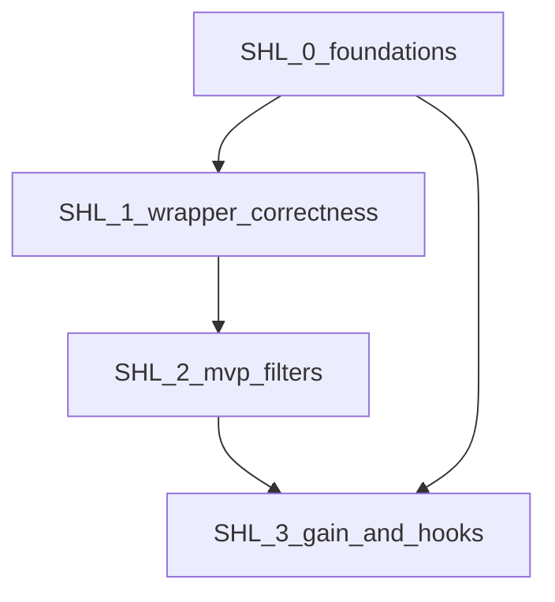

# oz Shell Compression — Sprint Plan

**Author**: oz-spec  
**Date**: 2026-04-25  
**Status**: Draft  
**PRD**: [oz-shell-compression-prd.md](oz-shell-compression-prd.md)  
**Pre-mortem**: [oz-shell-compression-premortem.md](oz-shell-compression-premortem.md)  
**Spec**: [../../specs/oz-shell-compression-specification.md](../../specs/oz-shell-compression-specification.md)  
**ADR**: [../../specs/decisions/0005-oz-shell-compression-architecture.md](../../specs/decisions/0005-oz-shell-compression-architecture.md)

---

## Capacity model

| Assumption | Value |
|---|---|
| Team size | 1 FTE (`oz-coding`) |
| Sprint length | 1 week |
| Practical throughput | 4-6 implementation stories per sprint |
| Quality buffer | 20% reserved for fixture updates, regressions, and docs |
| Merge policy | Launch-blocking Tiger mitigations must land before feature completion |

Planning rule:

- Sprint commitments should prioritize launch-blocking quality gates before breadth.

---

## Release objective

Ship v1 of shell compression with:

- `oz shell run -- <cmd...>`
- deterministic compaction for MVP command families (`git status`, `git diff`, `rg`, `go test`)
- `oz shell gain` in v1
- opt-in transparent interception (suggest-mode default)
- quality gates that directly mitigate Tigers T1, T2, T3, and T7

---

## Sprint SHL-0 — Foundations and contracts

**Goal:** lock command contracts, tracking schema, and test harness before feature logic.

### SHL-0 Stories

| ID | Story | Est. | Acceptance criteria |
|---|---|---:|---|
| SHL-0-01 | CLI contract skeleton (`oz shell run`, `oz shell gain`) | M | Cobra command surfaces and flags match spec; no functional filter logic yet |
| SHL-0-02 | Envelope + schema types (`schema_version`, token fields, warnings, refs) | M | JSON output compiles and validates in unit tests |
| SHL-0-03 | Tracking store baseline (SQLite schema + retention policy hooks) | L | create/write/query paths in tests; retention boundary logic present |
| SHL-0-04 | Fixture framework for command-output goldens | M | fixture loader + snapshot helper available for SHL-1 and SHL-2 |
| SHL-0-05 | Benchmark harness for overhead (`median`, `p95`) | S | benchmark command or test skeleton wired in CI optional path |

### SHL-0 Quality gates (must pass by end of SHL-0)

- **T7 guardrail (partial):** tracking aggregation unit tests for totals and retention math.
- deterministic serialization tests for envelope objects.

### SHL-0 Exit criteria

- `oz shell run` and `oz shell gain` command scaffolds exist with stable contracts.
- tracking backend is usable by follow-on stories.

---

## Sprint SHL-1 — Core `oz shell run` correctness gates

**Goal:** ship safe execution wrapper and pass all launch-blocking correctness gates except `gain`.

### SHL-1 Stories

| ID | Story | Est. | Acceptance criteria |
|---|---|---:|---|
| SHL-1-01 | Process execution + raw capture (`stdout/stderr/exit`) | M | wrapper executes commands once and captures outputs |
| SHL-1-02 | Exit-code propagation (strict) | M | integration suite proves exact pass-through for success/failure |
| SHL-1-03 | Generic compact profile + fallback-to-raw | M | compact mode works for unknown commands and recovers on filter error |
| SHL-1-04 | Tee-on-failure (`failures` mode) | S | failing commands persist raw output reference |
| SHL-1-05 | JSON output (`--json`) with warnings and refs | S | schema complete and stable in tests |

### SHL-1 Quality gates (must pass by end of SHL-1)

- **T2 (Launch-Blocking):** exit-code propagation tests pass 100%.
- **T1 (Launch-Blocking, baseline):** failure context preserved in generic profile fixtures.
- no panics on malformed/large outputs in wrapper path.

### SHL-1 Exit criteria

- `oz shell run` is safe and functional without command-family specialization.

---

## Sprint SHL-2 — MVP filter families + determinism

**Goal:** land specialized filters and deterministic behavior for v1 MVP.

### SHL-2 Stories

| ID | Story | Est. | Acceptance criteria |
|---|---|---:|---|
| SHL-2-01 | `git status` compact filter | M | staged/unstaged/change signal preserved |
| SHL-2-02 | `git diff` compact filter | M | file/change summary preserved with non-zero error safety |
| SHL-2-03 | `rg` grouped filter | M | grouped by file with representative lines |
| SHL-2-04 | `go test` failure-focus filter | L | failing packages/tests preserved, pass-noise reduced |
| SHL-2-05 | Deterministic output ordering rules | M | same fixture input -> byte-identical output |
| SHL-2-06 | Token reduction assertions by family | S | KR1 threshold checks integrated in CI suite |

### SHL-2 Quality gates (must pass by end of SHL-2)

- **T1 (Launch-Blocking):** failure-line preservation fixtures for all MVP families.
- **T3 (Launch-Blocking):** determinism snapshots pass in CI.
- KR1 achieved (`>= 60%` median reduction across MVP fixtures).

### SHL-2 Exit criteria

- MVP compact filters operational and test-enforced.

---

## Sprint SHL-3 — `oz shell gain` + transparent interception

**Goal:** deliver analytics command and optional transparent mode with safe defaults.

### SHL-3 Stories

| ID | Story | Est. | Acceptance criteria |
|---|---|---:|---|
| SHL-3-01 | `oz shell gain` human-readable summary | M | command shows totals for invocations, tokens before/after, reduction pct, timing |
| SHL-3-02 | `oz shell gain --json` contract | S | deterministic JSON schema and field semantics |
| SHL-3-03 | `oz shell gain` retention-window behavior | S | metrics exclude expired records correctly |
| SHL-3-04 | Hook interception suggest-mode default | M | opt-in integration path documented and tested |
| SHL-3-05 | Auto-rewrite opt-in control + exclusions | M | explicit toggle and exclusion list behavior tested |
| SHL-3-06 | Docs + release notes + rollout checklist | S | architecture/spec/test docs aligned with shipped behavior |

### SHL-3 Quality gates (must pass by end of SHL-3)

- **T7 (Launch-Blocking):** `oz shell gain` aggregation and retention correctness tests pass.
- **T4 (Fast-Follow addressed early):** suggest-mode default and explicit opt-in proven.
- KR6 achieved (`oz shell gain` available in v1).

### SHL-3 Exit criteria

- v1 scope complete per PRD.

---

## Tiger-to-test mapping (quality matrix)

| Tiger | Risk | Required test/gate | Sprint |
|---|---|---|---|
| T1 | Failure signal loss | failure-fixture preservation tests for generic + MVP filters | SHL-1, SHL-2 |
| T2 | Exit-code regression | strict integration suite for command status passthrough | SHL-1 |
| T3 | Non-determinism | golden determinism snapshots (same input twice) | SHL-2 |
| T4 | Hook surprise | suggest-mode default tests + opt-in rewrite tests | SHL-3 |
| T5 | Overhead risk | benchmark checks for `median`/`p95` overhead | SHL-0, SHL-3 |
| T6 | Tool-version drift | fallback-rate monitoring and fixture refresh protocol | SHL-3 onward |
| T7 | Gain metric correctness | aggregation/retention/json-schema tests for `oz shell gain` | SHL-0, SHL-3 |

---

## Definition of done (feature-level)

The feature is done only when all are true:

1. v1 commands are available: `oz shell run`, `oz shell gain`.
2. Launch-blocking Tigers (T1, T2, T3, T7) have passing automated gates.
3. KR1, KR2, KR3, KR4, KR6 are met or explicitly waived with documented rationale.
4. docs/specs/ADR/test-plan are consistent with shipped behavior.

---

## Post-v1 backlog

| Item | Why | Priority |
|---|---|---|
| Expand command-family coverage | improve token savings across broader workflows | High |
| Advanced `oz shell gain` modes (`daily`, `history`, richer grouping) | better operational insight | Medium |
| Drift detector for parser health | early warning for command output changes | Medium |
| Additional transparent integrations | reduce adoption friction | Medium |

---

## Dependency graph

Critical path: `SHL-0 -> SHL-1 -> SHL-2 -> SHL-3`
