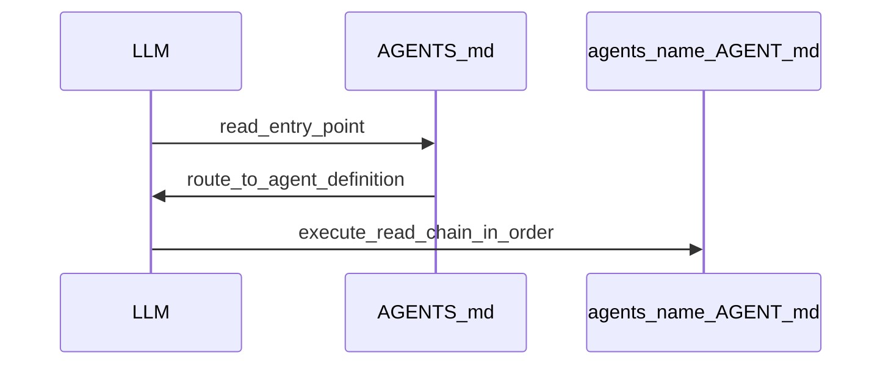
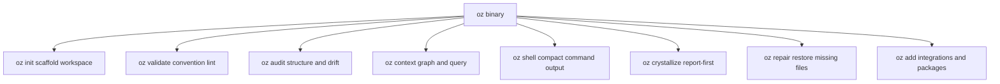

# oz — Project Specification

> This document is the canonical context for any LLM or contributor working on oz.
> Read it fully before writing any code.

---

## What is oz?

oz is an open source **workspace convention and toolset** for LLM-first development.

It solves a specific problem: LLMs (Claude, Codex, Cursor, etc.) have no persistent
understanding of a codebase. Every session starts from zero. oz gives any LLM a
structured, predictable workspace it can immediately understand — with clean
integrations for Claude Code, Cursor, and any other editor or model.

oz is **not** an agent orchestrator. It is a convention + toolset that any LLM can
follow by reading markdown files. The convention integrates cleanly with providers
rather than abstracting them away.

The core idea: open the workspace, read AGENTS.md, and the LLM knows exactly what
to do.

---

## Core Concepts

### The Workspace Convention

An oz workspace is a directory with a specific structure. Any LLM entering an oz
workspace reads `AGENTS.md` first, gets routed to the correct agent definition,
and executes a read-chain that loads the right rules, context, and specs before
starting work.

### The Read-Chain

Each agent definition specifies a read-chain — an ordered list of files to load
before starting any task. This is the LLM's boot sequence. It controls what the
LLM knows about itself, its constraints, and the codebase before it acts.



### Source of Truth Hierarchy

When information conflicts, oz defines a strict trust order (highest to lowest):

1. `specs/` — architectural decisions and specifications (highest trust)
2. `docs/` — architecture docs, open items
3. `context/` — oz-generated graph artifacts (query via `oz context query` or MCP)
4. `notes/` — raw thinking, uncrystallized ideas (lowest trust)

Code is the source of truth for behaviour. When code and spec diverge, the code
wins — but the spec is flagged and updated to reflect reality.
Drift is detected by `oz audit`.

### Agents

Agents are role definitions — markdown files that tell an LLM how to behave,
what it's responsible for, what's out of scope, and what read-chain to follow.
Agents are not code. They are conventions.

Agents share context via `context/` at the workspace root, organized by topic.
Any agent can read any context topic.

#### AGENTS.md agent routing

`AGENTS.md` is the LLM entry point. Under `## Agents`, the workspace MUST include a single
markdown **routing table** (not free-form subsections) with exactly these columns, in order:

| Column | Purpose |
|---|---|
| **Agent** | Bold handle for the agent (e.g. `**oz-coding**`). Convention: matches the directory name under `agents/<name>/`. |
| **Use when** | One scannable line of **routing hints**: concrete situations (paths, commands, artefact types) where this agent is the right choice — not a vague job title. Prefer disambiguation (“X, not Y”) when two agents are easy to confuse. Avoid pipe characters (markdown column separators) inside the cell. |
| **Definition** | Backtick path to `agents/<name>/AGENT.md`. |

Optional packages and other tooling MAY append rows to this table when they register an agent,
using the same column shape so merges stay predictable.

`OZ.md` carries a **Registered Agents** table with the same three columns for the workspace manifest;
keep **Use when** text aligned between the two files when both exist.

#### AGENT.md required sections

Every `agents/<name>/AGENT.md` must contain these sections in order:

| Section | Purpose |
|---|---|
| `## Role` | One-paragraph description of what this agent does and its operating constraints |
| `## Read-chain` | Ordered list of files to load before starting any task (context only — not rules) |
| `## Rules` | Rule files that govern this agent's behavior — hard constraints, not just reading material |
| `## Skills` | Skills this agent is authorized to invoke (`skills/<name>/`) |
| `## Responsibilities` | Bulleted list of what this agent owns and produces |
| `## Out of scope` | Explicit disownment — what this agent must not do |
| `## Context topics` | Which `context/` topics this agent reads when relevant |

**Read-chain vs. Rules**: The read-chain loads context and understanding. Rules are behavioral constraints the agent must follow without exception. Keep them separate so the distinction is unambiguous — both to the LLM and to `oz validate`.

### Skills

Skills are reusable task playbooks that agents invoke to complete well-defined procedural tasks.
Each skill lives in `skills/<name>/` and has a fixed internal structure:

| Path | Purpose |
|---|---|
| `SKILL.md` | Entry point. Describes when to invoke the skill and the steps to follow. |
| `references/` | Sub-instructions and routing for skills with multiple execution paths. Each file covers one path. |
| `assets/` | Templates, examples, and support files the skill uses during execution. |

`references/` and `assets/` are optional for trivial skills, but required for skills with branching logic or templated outputs.

#### SKILL.md required frontmatter

Every `skills/<name>/SKILL.md` must begin with a YAML frontmatter block:

```yaml
---
name: <skill-name>
description: <One sentence describing what the skill does and when it is useful.>
triggers:
  - <keyword or phrase that should invoke this skill>
---
```

| Field | Purpose |
|---|---|
| `name` | The skill name. Must match the directory name (kebab-case). |
| `description` | One sentence summary for discovery by `oz context`. |
| `triggers` | Keywords/phrases used by `oz validate` and `oz context` for skill surfacing. |

#### SKILL.md required sections

Every `skills/<name>/SKILL.md` must contain these sections (after the frontmatter):

| Section | Purpose |
|---|---|
| `## When to invoke` | The conditions or signals that should trigger this skill |
| `## Steps` | Ordered, actionable instructions for executing the skill |

Additional sections (e.g. `## References`, `## Notes`) are allowed but not required.

---

## Workspace Structure

```mermaid
flowchart TB
  root["Workspace root"]
  root --> entry["AGENTS.md entry for LLMs"]
  root --> oz["OZ.md manifest"]
  root --> readme["README.md"]
  root --> agentsDir["agents/name/AGENT.md"]
  root --> specsDir["specs/decisions ADRs"]
  root --> docsDir["docs architecture open-items"]
  root --> ctxDir["context/topic/summary.md shared"]
  root --> skillsDir["skills/name SKILL references assets"]
  root --> rulesDir["rules/coding-guidelines.md"]
  root --> notesDir["notes/"]
  root --> codeDir["code/ README optional submodules"]
  root --> toolsDir["tools/"]
  root --> scriptsDir["scripts/"]
```



### Key conventions

- `AGENTS.md` is the single entry point for any LLM. It always exists at root and MUST route
  agents using the `## Agents` markdown table defined above.
- `OZ.md` is the workspace manifest. It declares the oz standard version and registered agents.
- `context/` holds oz-generated artifacts: `graph.json` (from `oz context build`), `semantic.json` (from `oz context enrich`), and `scoring.toml` (BM25F tuning). Treat `graph.json` and `semantic.json` as tool output only. `scoring.toml` is configuration (may be edited via `oz context scoring` or checked in by hand). Query the graph via `oz context query` or the MCP server.
- `code/` holds actual project code. May contain git submodules.
- `notes/` is the only low-trust layer. Everything else should be considered authoritative.
  Optional convention: `notes/planning/` for product-management artifacts (PRDs, pre-mortems, sprint plans) that inform work but are not normative until promoted to `specs/` or `docs/`.

---

## The oz Toolset

oz ships as a **single Go binary** with subcommands:



### oz shell (planned)

Executes shell commands with deterministic output compaction to reduce LLM token usage while
preserving exit codes and error visibility. V1 also includes `oz shell gain` for local
token/perf savings summaries.

`oz shell` also includes a planned language-aware reader surface:

- `oz shell read <file...>` for file input
- `oz shell read -` for stdin input

`oz shell read` is intended for read-heavy workflows (`cat`-style usage) and applies
deterministic, language-aware filtering with strict safety fallback to raw content when
a filter produces empty output for non-empty input. Line-window flags (`--max-lines`,
`--tail-lines`) and line numbering are part of the planned command contract.

Normative contract:

- `specs/oz-shell-compression-specification.md`
- `specs/decisions/0005-oz-shell-compression-architecture.md`

### oz init (priority — build this first)

Interactively scaffolds a new oz workspace. Asks:

- Project name
- Description
- Code directory mode: `inline` or `submodule`
- Agents: use default (`maintainer` only) or define custom agents

Generates the full directory structure and all required files from templates.

### oz validate (build second)

Lints a workspace against the oz convention. Reports:

- Missing required files/directories
- Missing recommended files/directories
- Agent definitions missing required sections (Role, Read-chain, Rules, Skills, Responsibilities, Out of scope, Context topics)
- OZ.md standard version
- `context/semantic.json` present but containing unreviewed nodes (warning, not error)

Exit code 0 = valid. Exit code 1 = invalid. Suitable for CI.

### oz audit (V1 complete)

On-demand workspace health checks (not automatic). Loads `context/graph.json` and walks
the workspace to report:

- **Orphans** (`ORPH001`–`ORPH003`): convention files with weak or missing inbound references.
- **Coverage** (`COV001`–`COV004`): agent scope paths vs disk and ownership overlaps.
- **Staleness** (`STALE001`–`STALE004`): graph / semantic overlay freshness.
- **Drift** (`DRIFT001`–`DRIFT003`): spec markdown references to missing `code/` paths,
  unknown exported identifiers (against graph `code_symbol` nodes), and exported symbols
  never mentioned in scanned markdown. Optional `--include-docs` and `--include-tests`.

Human output groups by severity; `--json` emits `schema_version: "1"` with sorted
`findings[]` and per-severity `counts`. Subcommands mirror each check; `oz audit graph-summary`
prints the historical node/edge summary. See `docs/architecture.md` and ADR 0001 for symbol
indexing policy (`go/parser` via `context build`, not tree-sitter in V1).

### oz context (V1 complete)

The knowledge graph engine. Shipped as V1 with the following subcommands:

**`oz context build`** — walks the workspace, parses all oz-convention files, extracts
cross-references, and writes a deterministic `context/graph.json`. Byte-identical output on
repeated runs with no changes (SHA-256 content hash embedded).

**`oz context query <text>`** — loads `graph.json`, **routes** agents with multi-field BM25F
(Porter stemming, temperature-scaled softmax, thresholds), then **retrieves** ranked context on
a separate graph-backed corpus: `context_blocks` (relevance, `min_relevance`, `max_blocks`),
`code_entry_points` and `implementing_packages` when applicable, plus scope and `excluded` / `reason`
as defined in `specs/routing-packet.md`. Relevant concepts from the semantic overlay are included
when present. The packet may include `reason: "no_relevant_context"` when an agent is chosen but
no block clears the retrieval floor. Supports `--raw` (debug JSON: routing scores, subgraph, and
per-candidate retrieval math) and `--include-notes` (OR with `retrieval.include_notes` in
`context/scoring.toml` to include the `notes/` tier in the retrieval corpus).

**`oz context scoring`** — inspect and edit `context/scoring.toml` (BM25F and **routing** keys under
`[bm25]`, `[fields]`, `[weights]`, `[routing]`, **retrieval** keys under `[retrieval]` and nested
`retrieval.*`, plus `tokenize`) without hand-editing: `show`, `get`, `set`, `list`, `describe`, and
`validate` (see `docs/implementation.md`).

**`oz context enrich`** — sends the structural graph to an LLM via OpenRouter and writes
`context/semantic.json` with extracted concept nodes and typed relationships. Requires
`OPENROUTER_API_KEY`. Default model: `openrouter/free` (OpenRouter Free Models Router).
Supports `--model` to choose a specific model.

**`oz context review`** — presents unreviewed concepts and edges from `semantic.json` in a
human-readable table, then prompts accept or reject for each item. Supports `--accept-all`
for CI pipelines.

**`oz context serve`** — starts an MCP stdio server (protocol version `2024-11-05`) exposing
four tools: `query_graph`, `get_node`, `get_neighbors`, `agent_for_task`. Wire into Claude
Code or Cursor with `{"mcpServers":{"oz":{"command":"oz","args":["context","serve"]}}}`.

Staleness detection: on `oz context query` and `oz context serve` startup, `graph_hash` in
`semantic.json` is compared against the current `graph.json` hash. A warning is printed if
they diverge.

Performance: `oz context build` completes in < 500ms on a 50-file workspace (benchmark:
`go test -bench=BenchmarkBuild_50Files ./internal/context/`). Query output averages ≤ 10%
of full workspace token size on the 10-agent test fixture.

### oz crystallize (V1 report-first)

`oz crystallize` classifies markdown notes under `notes/` and reports likely canonical targets
(`specs/`, `docs/`, or ADRs). By default it is report-only and does not write, move, or delete
files. With `--dry-run`, it also prints proposed diffs to support manual promotion decisions.

Promotion is a deliberate human decision. Use `oz crystallize` to identify candidates, then
manually move or promote content — or use the `oz-notes` agent for interactive guidance
through the promotion workflow.

### oz repair

`oz repair [path]` restores missing default workspace files without overwriting anything that
already exists. Reads `OZ.md` to discover the project name and registered agents, then
re-scaffolds any absent files from the same embedded templates used by `oz init`.

Useful when: a workspace was partially deleted, a git merge dropped scaffolded files, or a
manual edit removed required structure. Safe to run repeatedly — idempotent on any complete
workspace.

Note: `CLAUDE.md` is opt-in only (`oz init --claude` / `oz add claude`) and is never restored
by `oz repair`.

### oz add

`oz add` installs integrations and optional packages into an existing oz workspace.

**Integrations:**

- `oz add claude [path]` — writes `CLAUDE.md` (loaded automatically by Claude Code) and
  installs `.claude/settings.json` hook configuration plus shared hook scripts under
  `.cursor/hooks/`. Use `--force` to overwrite an existing `CLAUDE.md`.
- `oz add cursor [path]` — writes `.cursor/hooks.json` and installs the shared hook scripts
  under `.cursor/hooks/`. Hooks enforce oz convention on every edit and gate git commits.

**Optional packages:**

- `oz add <package-id> [path]` — installs a bundled agent + skill tree from embedded templates.
  Use `oz add list` (alias: `oz add ls`) for a formatted table of available packages.

All `oz add` subcommands resolve the workspace root by walking ancestor directories for
`AGENTS.md` and `OZ.md`, so they can be run from any subdirectory.

---

## Design Principles

1. **Convention over configuration.** oz workspaces are predictable. Any LLM or
   human can understand the structure without reading docs.

2. **Clean provider integrations.** oz works with Claude, Codex, Cursor, or any LLM.
   Markdown is the common interface; first-class integrations (hooks, CLAUDE.md, MCP)
   let each provider participate fully.

3. **Convention-enforced.** The read-chain and hierarchy are backed by hooks and
   `oz validate`. Conventions are machine-checkable, not just hoped-for.

4. **Code wins, spec follows.** Code is the source of truth for behaviour.
   When code and spec diverge, the spec is flagged and updated to match.
   Drift is surfaced by `oz audit`.

5. **Single binary.** oz ships as one Go binary. No runtime dependencies.
   Install with one command.

6. **oz eats its own dog food.** The oz repository is itself an oz workspace.

---

## Current Status (V1 complete — April 2026)

- **oz init**: complete — scaffolds a full oz-compliant workspace from embedded templates.
- **oz validate**: complete — enforces all 7 required AGENT.md sections, checks required files/directories, warns on unreviewed semantic nodes.
- **oz audit**: V1 complete — orphans, coverage, staleness, drift, JSON report, deterministic ordering, `graph-summary` stub preserved. Multi-language / tree-sitter drift is deferred.
- **oz context**: V1 complete — `build`, `query`, `scoring`, `enrich`, `review`, and `serve` all ship. MCP server validated. BM25F **routing** (agent selection) and BM25-based **retrieval** (ranked `context_blocks` and related fields per `specs/routing-packet.md`).
- **oz crystallize**: V1 report-first complete — classification table + dry-run diffs; no direct promotion writes.
- **oz repair**: complete — restores missing default workspace files without overwriting existing ones; idempotent; excludes `CLAUDE.md` (opt-in only).
- **oz add**: complete — `oz add claude`, `oz add cursor` for editor integrations; `oz add <package-id>` for optional bundled agent+skill packages; `oz add list` enumerates available packages.

See `docs/architecture.md` for the full system design and `docs/implementation.md` for the V1 implementation snapshot.
