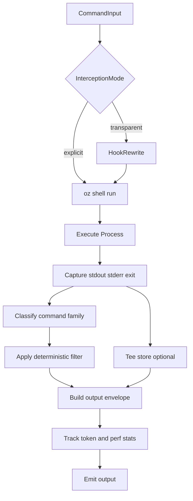

# oz Shell Compression Layer Specification

> Normative specification for a shell-output compression layer in `oz`.
> This layer reduces LLM token usage for shell-heavy workflows while preserving correctness.

---

## Status

- **Version:** v1
- **Date:** 2026-04-25
- **Owner:** oz-coding
- **Related ADR:** `specs/decisions/0005-oz-shell-compression-architecture.md`

---

## 1. Problem Statement

LLM-assisted development spends substantial token budget on shell outputs that are verbose but low-signal:

- command progress boilerplate
- repeated log lines
- full success output where only a summary is needed
- mixed pass/fail test output where failures are the actionable subset

`oz context query` optimizes *what to read* from workspace artifacts, but it does not optimize all shell command output delivered to the model during active coding workflows.

This specification defines a new `oz` shell layer that:

1. executes shell commands,
2. applies deterministic compression/filtering,
3. preserves failure semantics and exit codes,
4. emits compact, machine-readable, and auditable output.

---

## 2. Goals and Non-Goals

### Goals

- Reduce shell-output token load for LLM sessions.
- Preserve command correctness and failure visibility.
- Keep behavior deterministic and testable.
- Support two usage modes in v1:
  - explicit wrapper (`oz shell run -- <cmd...>`)
  - optional transparent interception (hook rewrite)
- Provide local metrics for before/after token estimates and runtime overhead.

### Non-Goals

- Replacing `oz context query` routing/retrieval.
- Lossy compression of authoritative source code text in critical review paths.
- Cloud telemetry as a hard dependency.
- Editing or mutating command intent beyond rewrite to `oz shell run`.

---

## 3. Terminology

- **Raw output:** unfiltered stdout/stderr captured from the executed command.
- **Compact output:** filtered/summarized output intended for LLM context.
- **Envelope:** structured JSON representation of a shell execution outcome.
- **Filter strategy:** deterministic transformation class (e.g., grouping, dedupe).
- **Tee artifact:** file containing raw output, persisted for post-failure inspection.

---

## 4. CLI Contract (Normative)

### 4.1 Command Surface

`oz` MUST expose:

- `oz shell run -- <command> [args...]`

`oz` MAY expose helper aliases in later versions (out of scope for v1).

### 4.2 Flags

`oz shell run` MUST support:

- `--mode compact|raw` (default: `compact`)
- `--json` (emit structured envelope)
- `--no-track` (disable local tracking write for this invocation)
- `--tee failures|always|never` (default: `failures`)
- `-v`, `-vv`, `-vvv` verbosity levels
- `-u`, `--ultra-compact` (optional extra compaction while preserving required fields)

### 4.3 Exit Codes

The command MUST preserve underlying exit status:

- `0` when wrapped command succeeds
- `N` (non-zero) when wrapped command exits with status `N`
- `1` only for `oz shell` internal failures before wrapped command execution

### 4.4 Passthrough Rule

If no specialized filter matches:

- `--mode compact`: apply generic safe truncation + dedupe profile
- `--mode raw`: output raw command output unchanged

If compaction fails after command execution, `oz shell` MUST fall back to raw output and include a warning in metadata.

---

## 5. Output Envelope (Normative)

When `--json` is enabled, `oz shell run` MUST emit this object:

```json
{
  "schema_version": "1",
  "command": "git status",
  "mode": "compact",
  "matched_filter": "git.status",
  "exit_code": 0,
  "duration_ms": 42,
  "token_est_before": 510,
  "token_est_after": 84,
  "token_est_saved": 426,
  "token_reduction_pct": 83.53,
  "stdout": "2 files changed; 1 staged, 1 unstaged",
  "stderr": "",
  "warnings": [],
  "raw_output_ref": null
}
```

Field requirements:

- `schema_version`: MUST be `"1"` in v1.
- `command`: MUST reflect effective command string.
- `mode`: MUST be `compact` or `raw`.
- `matched_filter`: filter id or `"generic"` / `"none"`.
- `exit_code`: wrapped process exit status.
- token fields: estimated with `ceil(chars/4.0)`.
- `raw_output_ref`: path to tee artifact when persisted, else `null`.

When not using `--json`, `oz shell run` MUST still preserve exit semantics and SHOULD print compact human output plus a tee hint when applicable.

---

## 6. Two-Mode Interception Model (Normative)

### 6.1 Explicit Wrapper Mode

Developer or agent calls:

- `oz shell run -- git status`
- `oz shell run -- go test ./...`

This mode MUST always be available and MUST work independently from hook installation.

### 6.2 Transparent Interception Mode (Optional, v1)

When enabled through hook configuration, shell commands SHOULD be rewritten to `oz shell run -- ...` before execution in supported agents.

Constraints:

- interception MUST be opt-in for v1.
- users MUST have per-command exclusions.
- hook failures MUST fail open (run original command).
- transparent mode MUST NOT alter command semantics beyond wrapper prefixing.

---

## 7. Execution Pipeline (Normative)



Pipeline invariants:

- command executes at most once per invocation.
- filter stage MUST not mutate exit status.
- tracking MUST never block command completion on write errors.
- tee writes MUST be best-effort.

---

## 8. Filter Strategy Taxonomy (Normative)

`oz shell` v1 MUST support these strategy classes:

1. **Stats extraction** (`git status`, `git diff`): aggregate totals and key states.
2. **Failure focus** (`go test`): retain failing tests/packages and summary counts.
3. **Grouping** (`rg`): group matches by file with capped sample lines.
4. **Deduplication** (logs): collapse repeated lines with frequency counts.
5. **Progress stripping**: remove transient progress lines and ANSI noise.
6. **Safe truncation**: bounded output with deterministic head/tail behavior.

### 8.1 Safety Invariants

Filters MUST preserve:

- non-zero exit visibility
- failure-identifying lines
- file/symbol identifiers needed for next actions
- parseable stderr for actionable diagnostics

Filters MUST NOT:

- suppress all error context on failures
- reorder failure records in non-deterministic ways
- claim success when the command failed

---

## 9. MVP Command Families (v1)

`oz shell` v1 MUST include specialized filters for:

- `git status`
- `git diff`
- `rg` (and optionally `grep`)
- `go test`

Unknown commands MAY use generic strategy in compact mode.

---

## 10. Configuration (Normative)

`oz shell` MUST define config at:

- global: `$XDG_CONFIG_HOME/oz/shell.toml` (or platform equivalent)
- workspace-local override: `.oz/shell.toml` (optional)

Config keys (v1):

- `[hooks]`
  - `enabled = true|false`
  - `exclude_commands = ["cmdA", "cmdB"]`
- `[tracking]`
  - `enabled = true|false`
  - `retention_days = <int>`
- `[tee]`
  - `enabled = true|false`
  - `mode = "failures" | "always" | "never"`
  - `max_files = <int>`
- `[filters]`
  - per-filter toggles and thresholds

Precedence:

1. CLI flags
2. workspace config
3. global config
4. built-in defaults

---

## 11. Tracking and Storage (Normative)

`oz shell` MUST support local metrics persistence for:

- command name
- timestamp
- duration
- estimated input/output tokens
- reduction percent
- matched filter
- exit code

Retention MUST be bounded (default 90 days).
Tracking write failures MUST NOT fail the command.

`oz shell` MAY implement SQLite in v1. Any storage backend MUST maintain equivalent queryability for aggregate reports.

---

## 12. Performance SLOs (Normative)

Targets for v1 on developer-class hardware:

- wrapper overhead (median): <= 15ms for short commands
- wrapper overhead (p95): <= 30ms for short commands
- memory overhead: <= 15MB resident for typical use

Overhead excludes wrapped command runtime.

---

## 13. Security and Privacy (Normative)

`oz shell` MUST:

- avoid sending shell output to network services by default.
- keep tracking local-only by default.
- redact obvious secret patterns in compact mode where practical.
- provide `--mode raw` for exact replay/debug.

`oz shell` MUST NOT require telemetry opt-in for core operation.

---

## 14. Testing Requirements (Normative)

`oz shell` implementation MUST include:

- unit tests for each filter strategy.
- golden tests for each MVP command family.
- deterministic output tests (same input, same output).
- exit-code propagation tests.
- token reduction threshold tests per family.
- tee persistence tests for failing commands.
- hook rewrite tests (when hook mode is enabled).

Fixture policy:

- prefer real-world command output captures.
- synthetic fixtures are allowed only for edge-case coverage.

---

## 15. Rollout Plan (Informative)

### Phase 0

- Land this specification and ADR.

### Phase 1

- Implement explicit mode (`oz shell run`) with MVP filter set.

### Phase 2

- Add optional transparent interception integrations.

### Phase 3

- Expand command coverage and stabilize performance/analytics.

---

## 16. Open Questions

- Should `oz shell` ship with standalone analytics commands (`oz shell gain`) in v1 or v2?
- Should transparent interception default to suggest mode before auto-rewrite for each agent integration?
- Should compact envelopes include optional line-level provenance for grouped results?
